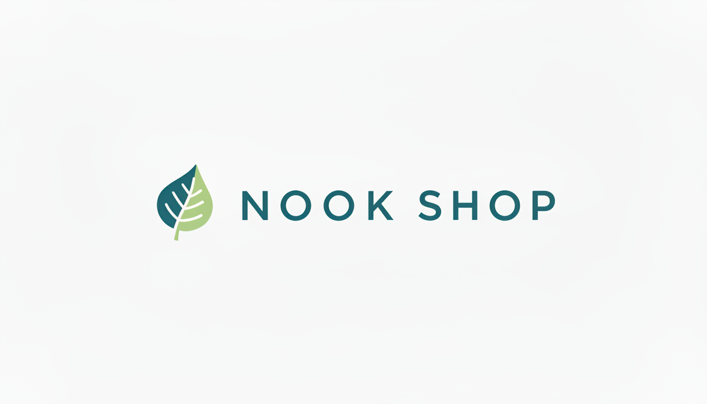
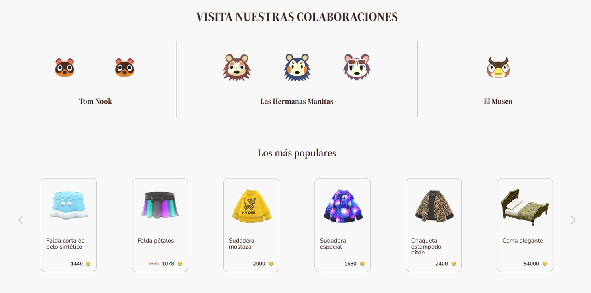
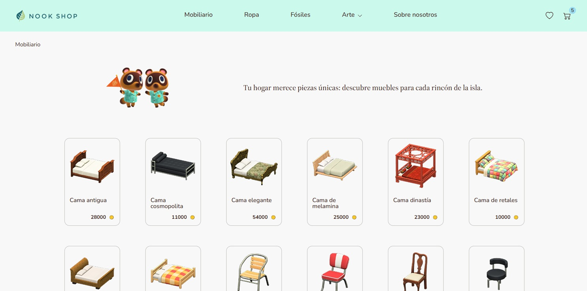
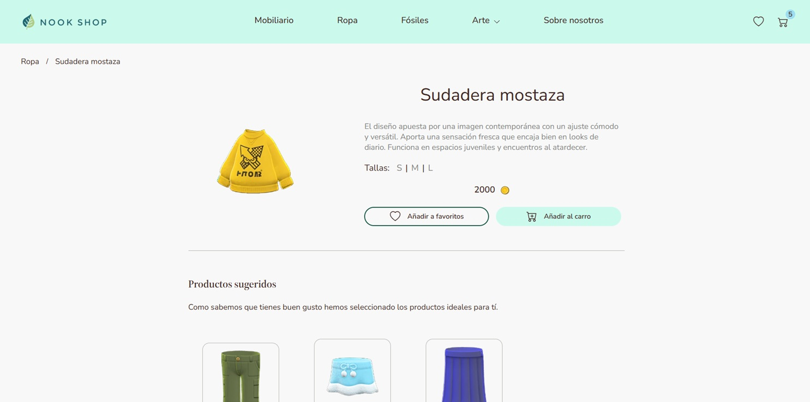
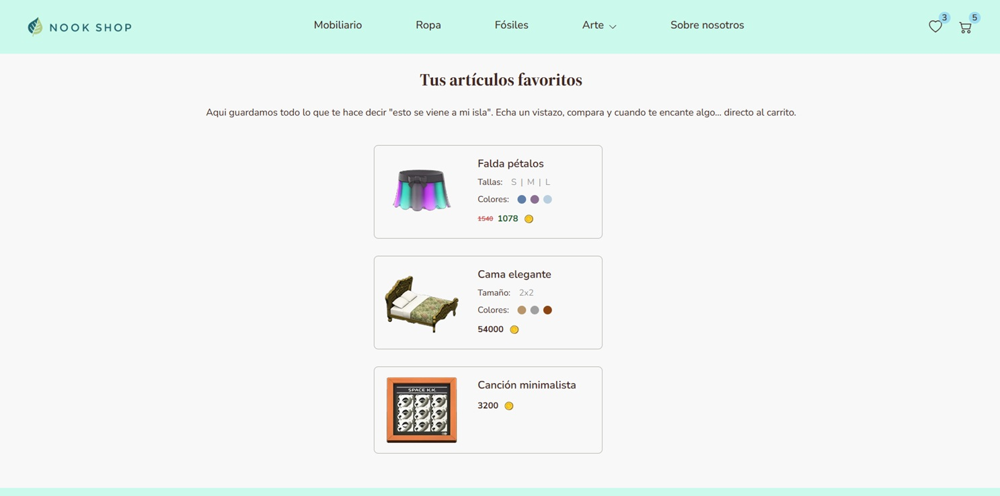
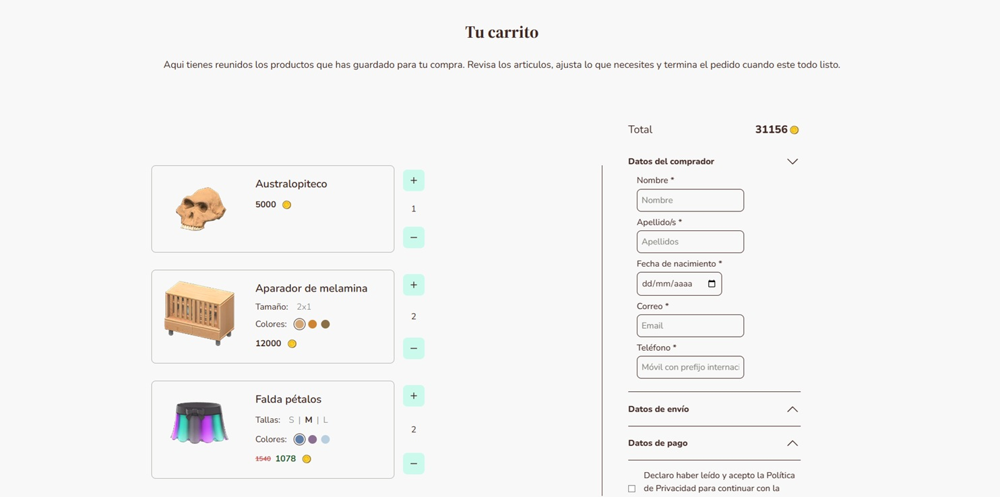
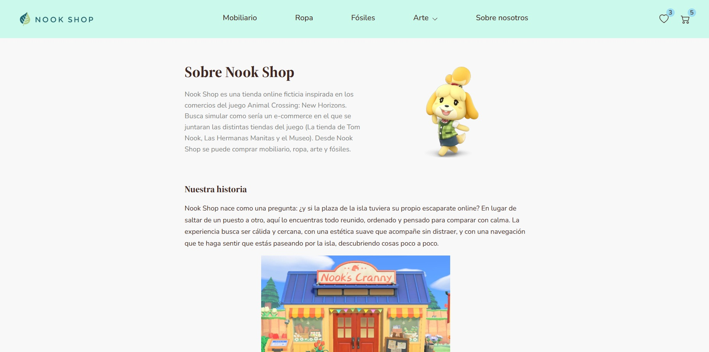

# Nook Shop

## Ejemplo en vivo
[Ver demo](https://daniel-nivall.github.io/Proyecto_final_Nook_Shop/)

## Descripción
Proyecto final sobre una tienda online de productos de Animal Crossing desarrollada con HTML, CSS y JavaScript. Este proyecto simula una experiencia de compra en línea, permitiendo a los usuarios explorar un catálogo de productos relacionados con el videojuego Animal Crossing, agregar artículos a su carrito de compras y realizar pedidos de manera simulada.

## ¿Que he aprendido en este proyecto?
Durante el desarrollo de este proyecto he aprendido a estructurar una web completa, a manipular el DOM, crear contenido dinámico y elementos interactivos con JavaScript. He mejorado en el uso de la propiedad display (grid o flex) según la necesidad, así como la propiedad position para colocar elementos en la página. Por último, también he ampliado mis conocimientos en organizar mejor el código HTML, CSS y JavaScript por secciones y funcionalidades, lo que me ha permitido trabajar de forma más eficiente y mantener el código más limpio.

Como conclusión, este proyecto me ha permitido mejorar mis habilidades en el desarrollo web, especialmente en la creación de interfaces de usuario atractivas y funcionales, así como en la gestión de datos y la implementación de interacciones clave para una tienda online. Sin embargo, también he aprendido que es importante planificar mejor la estructura y la nomenclatura de las clases desde un principio, ya que esto puede ahorrar mucho trabajo a largo plazo, especialmente cuando se tienen estructuras parecidas en distintas páginas.

## Tecnologías utilizadas
  

## Vista previa del proyecto
Si quieres hechar un vistazo al proeycto, te recomiendo:

## Autor
DANIEL NICETO VALLDEPERAS

- [Correo electrónico](mailto:daniel.nivall1999@gmail.com)
- [LinkedIn](https://www.linkedin.com/in/daniel-niceto-98340b158)
- [GitHub](https://github.com/Daniel-NiVall)

## Instalación
Este proyecto únicamente requiere abrirlo usando la extensión Live Server de Visual Studio Code para poder visualizarlo correctamente.

## Licencia
MIT Public License v3.0. No puede usarse comecialmente.
